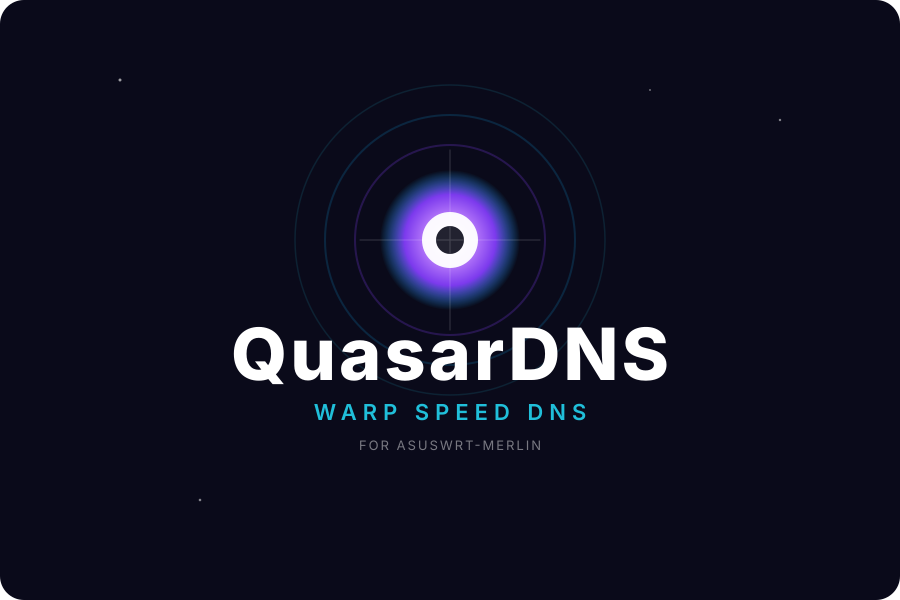

# QuasarDNS

<p align="center">
  
</p>

> Futuristic DNS SpeedTest for Asuswrt-Merlin — find the fastest DNS for your location, automatically.

Inspired by [dnsspeedtest.online](https://dnsspeedtest.online) but built for routers. Runs directly on **Asus RT-AC86U** and any Merlin-supported device. Diversion & Skynet safe.

    

### Why Quasar?

A quasar is the brightest, most energetic object in the universe — like the fastest DNS path through the cosmic noise of the internet.

### Features
- **Replica of dnsspeedtest.online** logic (`DoH` servers + `TIMEOUT_PENALTY 5000ms`) but via `dig` UDP 53 for `dnsmasq`
- **BusyBox compatible** — no `cat -n`, no `date +%s%3N`, uses `Query time` from `dig +stats`
- **Diversion-safe** — only touches `nvram` (`wan0_dns1_x`/`wan0_dns2_x`), never `dnsmasq.conf.add` or `pixelserv`
- **Skynet-safe** — validates with `dig @IP` before applying
- **Auto mode** — cron every 3 days, applies only if `>5ms` and `>15%` faster (no flapping)
- **Tested on RT-AC86U** Merlin 386.x

### Quick Start

```bash
# 1. Install Entware deps (via amtm)
opkg update && opkg install bind-dig

# 2. Copy to router
scp quasardns.sh admin@192.168.1.1:/jffs/scripts/quasardns.sh
ssh admin@192.168.1.1 "chmod +x /jffs/scripts/quasardns.sh"

# 3. Dry-run (no changes)
sh /jffs/scripts/quasardns.sh

# 4. Apply best DNS
sh /jffs/scripts/quasardns.sh --apply

# 5. Cron - check every 3 days at 04:00
cru a QuasarDNS "0 4 */3 * * /jffs/scripts/quasardns.sh --auto >> /jffs/quasar.log 2>&1"
# Persist after reboot
echo 'cru a QuasarDNS "0 4 */3 * * /jffs/scripts/quasardns.sh --auto >> /jffs/quasar.log 2>&1"' >> /jffs/scripts/services-start
```

### Usage
```
QuasarDNS - Find the fastest DNS for your Merlin router
Usage: sh quasardns.sh [--help|--apply|--auto]
  (no args)  Dry-run only, no changes
  --apply    Benchmark and apply best 2 DNS to nvram
  --auto     Apply only if >5ms and >15% faster (for cron)
```

### Example Output
```
Cloudflare      1.1.1.1           19 ms (3/3 ok)
Google          8.8.8.8           19 ms (3/3 ok)
Quad9           9.9.9.9           19 ms (3/3 ok)
1 19 Cloudflare 1.1.1.1 (3/3 ok)
2 19 Quad9 9.9.9.9 (3/3 ok)
DRY-RUN current: 1.1.1.1 1.0.0.1 -> best: 1.1.1.1 (Cloudflare 19ms)
```

### How it works
Benchmarks 7 DNS (Cloudflare, Google, Quad9, OpenDNS, AdGuard, NextDNS, DNS4EU) against `google.com`, `youtube.com`, `wikipedia.org` using `dig +stats` and `Query time`. Same hosts/servers as `dnsspeedtest.online:8` and `dnsspeedtest.online:16`. Failed queries get `5000ms` penalty.

Applies via `nvram set wan0_dns1_x` / `wan_dns1_x` + `service restart_dnsmasq` — identical to GUI `WAN -> DNS Server`.

### Diversion
Diversion filters **before** forwarding. Changing upstream WAN DNS does not disable blocking. Verified with `nslookup doubleclick.net 127.0.0.1 -> 0.0.0.0`.

### Rollback
```bash
cat /jffs/dns_backup.txt
nvram set wan0_dns1_x=1.1.1.1; nvram set wan0_dns2_x=1.0.0.1; nvram commit; service restart_dnsmasq
```

### License
MIT — see [LICENSE](LICENSE)

### Credits
Inspired by [Silviu Stroe - dnsspeedtest.online](https://dnsspeedtest.online) (GPL-3.0). QuasarDNS is an original BusyBox/sh implementation.
