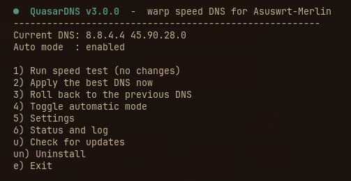

# QuasarDNS

<p align="center">
  
</p>

> DNS speed test and optimizer for Asuswrt-Merlin — find the fastest DNS for your connection, and keep it that way.

Inspired by [dnsspeedtest.online](https://dnsspeedtest.online) but built for routers. Runs directly on your **Asuswrt-Merlin** router, works with **amtm**, and plays nicely with Diversion & Skynet.

   

### Why Quasar?

A quasar is the brightest, most energetic object in the universe — like the fastest DNS path through the cosmic noise of the internet.

### Features

- **Real benchmark** — 7 public resolvers × 3 popular domains × 5 rounds, measured from the **resolver's own reported query time** (Entware `drill`, 1 ms resolution), so the score reflects DNS latency and nothing else; **both IPs of each resolver are tested and the better score is kept** (some networks block `1.1.1.1`); the score is the **mean after dropping the slowest 20 %**, failed queries get a `5000 ms` penalty
- **Never changes the kind of DNS you use** — resolvers are grouped as `plain`, `security` (malware/phishing blocking) or `ads`; in `auto` mode only resolvers of the same group as your current DNS are considered, so your filtering is never silently added or removed (see [Resolver profiles](#resolver-profiles))
- **Safe by design** — refuses to run when it would have no effect or conflict: DNS-over-TLS, Unbound, AdGuardHome, dnscrypt-proxy (override with `--force`); verifies the new servers answer *before* applying; verifies the router still resolves *after* applying and **rolls back automatically** if not
- **Auto mode** — cron job (default: every 3 days at 04:00) that applies changes only when the gain is `>= 5 ms` **and** `>= 15 %` (no flapping); never takes over DNS that is provided by your ISP
- **One-step rollback** — `quasardns --rollback` restores the previous settings; changes take effect immediately, without restarting the WAN
- **Interactive menu** and full CLI
- **amtm ready** — supports `amtmupdate`, so `amtm` can update it together with your other add-ons
- **Housekeeping** — lock file (no overlapping runs), log rotation, idempotent cron / startup hook, no writes at all on a dry-run
- **BusyBox compatible** — plain POSIX `sh`, no bashisms

### Requirements

- Asuswrt-Merlin with *Administration → System → Enable JFFS custom scripts and configs = Yes*
- **Recommended for accurate results**: [Entware](https://entware.net) with `drill` and `coreutils-timeout`
  ```sh
  opkg update && opkg install drill coreutils-timeout
  ```
- Without Entware it still runs on the stock BusyBox `nslookup` — no extra install, but see [Measurement accuracy](#measurement-accuracy)

### Measurement accuracy

The score has to mean *how fast the resolver is*. Two details decide whether it actually does.

**Where the number comes from.** `drill` reports the query time itself (`;; Query time: N msec`), measured inside `ldns` at 1 ms resolution. BusyBox `nslookup` reports nothing, so the only way to time it is to wrap the whole process in a clock — and the best clock available on this firmware is `/proc/uptime`, which only moves in 10 ms steps (19, 29, 39 ms…), so every measurement is rounded to the nearest 10.

**What `nslookup` charges you for.** To print `Address 1: <ip> <name>` it resolves the server's name first, and that extra query goes to the very resolver under test. Because its cost scales with that resolver's latency, it is not a fixed offset — it swamps the signal. Measured on an RT-AC86U, same resolver, same host:

| | `nslookup` | `drill` |
| --- | --- | --- |
| Cloudflare `1.1.1.1` | 242 ms | **41 ms** |
| NextDNS `45.90.28.0` | **213 ms** | 62 ms |
| spread within one resolver | 100 – 1510 ms | 30 – 50 ms |

With `nslookup`, NextDNS looks like the fastest resolver on the planet and Cloudflare looks mid-table; `drill` shows the opposite. That is why QuasarDNS prefers `drill` and only falls back to `nslookup` when Entware is not available — in that mode it tells you the numbers are coarse.

**It changes decisions, not just displayed numbers.** Two `--dry-run`s on the same router a minute apart, one per tool, comparing the DNS you already use against the best available:

| | current | best | gain | `--auto` would |
| --- | --- | --- | --- | --- |
| `drill` | 26 ms | 24 ms | 2 ms | **skip** — below `MIN_GAIN_MS` |
| `nslookup` | 229 ms | 178 ms | 51 ms (22 %) | **apply** — over both thresholds |

The real difference between those resolvers is ~2 ms. The 51 ms that `nslookup` reports is mostly its own overhead, which is why `MIN_GAIN_MS` cannot catch it: at 50-100 ms of measurement noise, any threshold low enough to be useful is also low enough to be triggered by noise.

### Install

Log in over SSH first — the installer asks whether to enable the automatic checks, so it needs a terminal:

```sh
ssh -t admin@192.168.1.1
```

Then, on the router:

```sh
curl -fsL -o /tmp/install.sh https://raw.githubusercontent.com/imanubdesigner/QuasarDNS/master/install.sh && sh /tmp/install.sh
```

The script is downloaded to a file rather than piped into `sh` on purpose: with `curl … | sh` the shell's stdin is the pipe, not your terminal, so the installer cannot ask you anything and silently leaves the automatic mode off.

Or, from a clone / zip on your PC — only two files are needed, `install.sh` and `quasardns.sh`:

```sh
mkdir -p /tmp/QuasarDNS                      # on the router, if it does not exist yet
scp -O install.sh quasardns.sh admin@192.168.1.1:/tmp/QuasarDNS/
ssh -t admin@192.168.1.1 'cd /tmp/QuasarDNS && sh install.sh'
```

`-O` is required because Merlin's Dropbear has no SFTP server. Avoid `scp -r`: it copies `.git/` and the other repository files onto the router.

The installer copies the script to `/jffs/scripts/quasardns`, keeps its data in `/jffs/addons/quasardns.d/`, adds a startup hook, reports which measurement tool it found, and finishes with a dry-run. Upgrading from v1.x? It removes the old `quasardns.sh`, the old cron line and migrates the old log; you can then delete `/jffs/dns_backup.txt`.

### Usage

```
quasardns                 Open the interactive menu
quasardns --dry-run       Benchmark only, no changes         (alias: test)
quasardns --apply         Benchmark and apply the best DNS   (add --force to override safety checks)
quasardns --auto          Apply only if clearly faster (what cron runs)
quasardns --rollback      Restore the DNS servers used before the last change
quasardns --enable        Schedule the automatic mode
quasardns --disable       Remove the schedule
quasardns status          Settings, cron state and last log lines
quasardns update          Check for and install a new version
quasardns uninstall
```

`/jffs/scripts` is not in the router's `PATH`: run these as `sh /jffs/scripts/quasardns <command>`.

### Menu

Running it with no arguments opens the menu — it shows the DNS you are using right now, the state of the automatic mode, and which measurement tool the next run will use:



The first three lines are the ones worth reading:

```
  Current DNS: 1.1.1.1 8.8.4.4
  Auto mode  : enabled
  Measuring  : drill, 1 ms resolution
```

`Measuring` tells you whether the numbers mean anything: `drill, 1 ms resolution` is a real measurement, `nslookup, 10 ms clock (coarse)` is rounded to the nearest 10 ms and must not be compared against a `MIN_GAIN_MS` of 5. See [Measurement accuracy](#measurement-accuracy).

What follows `Current DNS` is your own setup: if *Connect to DNS Server automatically = Yes* the WAN DNS is assigned by your ISP and changes when you reconnect, otherwise it is whatever QuasarDNS applied.

### Example output

Real `--dry-run` output from the test router (an RT-AC86U, `samples: 5`):

```
=== QuasarDNS SpeedTest (Sat Oct  3 10:46:22 CEST 2026) ===
Hosts: google.com youtube.com wikipedia.org  |  samples: 5  |  resolvers: plain (current DNS not recognized: unfiltered resolvers only)

Cloudflare      1.1.1.1           24 ms (15/15 ok) [plain]
Google          8.8.8.8           25 ms (15/15 ok) [plain]
NextDNS         45.90.28.0        41 ms (15/15 ok) [plain]
DNS4EU          86.54.11.200      38 ms (15/15 ok) [plain]
Quad9           9.9.9.9           24 ms (15/15 ok) [security]
OpenDNS         208.67.222.222    38 ms (15/15 ok) [security]
AdGuard         94.140.15.15      38 ms (15/15 ok) [ads]

--- Ranking (fastest -> slowest) ---
1 24 ms Cloudflare 1.1.1.1 (15/15 ok)
2 25 ms Google 8.8.8.8 (15/15 ok)
3 38 ms DNS4EU 86.54.11.200 (15/15 ok)
4 41 ms NextDNS 45.90.28.0 (15/15 ok)

Current: ISP (automatic) 8.8.4.4 -> 26 ms
DRY-RUN current: ISP (automatic) 8.8.4.4 -> best: 1.1.1.1 8.8.8.8 (Cloudflare 24ms)
Use --apply to apply or --auto for cron
```

Two things worth reading twice. Both IPs of each resolver are tested and the faster one is applied as primary, so you may see `1.0.0.1` or `149.112.112.112` instead of the address you expect: some ISPs block `1.1.1.1` and not its pair. And the score is only counted when the answer is `NOERROR` **and** carries an `ANSWER SECTION` — a lookup that fails fast is recorded as a failure, not as a fast success, which is why the column reads `14/15 ok` when a single sample timed out.

Only the resolvers of the selected profile are ranked (here `plain`, the group of your current DNS — see [Resolver profiles](#resolver-profiles)); the others are still measured and listed above. Google and OpenDNS show their *secondary* address because it was the one that answered fastest here — that is the both-IPs rule at work. Your own numbers depend on your line.

### Settings

Stored in `/jffs/addons/quasardns.d/config` (edit from the menu → *Settings*):

| Key | Default | Meaning |
| --- | --- | --- |
| `PROFILE` | `auto` | `auto` = same group as your current DNS (`plain` if unknown) · `plain` · `security` · `ads` · `all` |
| `DNS2_MODE` | `auto` | Secondary DNS: `next` = second-best provider · `same` = the provider's own secondary · `auto` = `next` for `plain`, `same` otherwise |
| `SAMPLES` | `5` | Rounds per domain (1–5) |
| `MIN_GAIN_MS` / `MIN_GAIN_PCT` | `5` / `15` | Thresholds for `--auto`. With `drill` these are meaningful at the default values; on the `nslookup` fallback they sit below the 10 ms clock step |
| `AUTO` | `disabled` | Whether the cron job is scheduled |
| `SCHEDULE` | `0 4 */3 * *` | Cron expression for `--auto` |
| `AMTMUPDATE` | `enabled` | Let amtm update this add-on |

### Resolver profiles

Resolvers are grouped by what they block, and only members of the selected profile compete in the ranking (the others are still measured, just not eligible):

| Profile | Blocks | Examples |
| --- | --- | --- |
| `plain` | nothing — resolves every domain | Cloudflare, Google, NextDNS, DNS4EU |
| `security` | known-bad domains: malware, phishing, cryptomining | Quad9, OpenDNS |
| `ads` | ads and trackers, on top of the malware blocking | AdGuard |

- `PROFILE` = `auto` (the default) follows what you use today: with a `plain` current DNS only `plain` resolvers are ranked, so QuasarDNS never adds or removes filtering behind your back.
- To let another group compete, change it from the menu: **`5) Settings` → `1) Resolver profile`** and type `security`, `ads` or `all` (one mixed ranking with every resolver).
- Applying a filtering profile switches DNS for **every device on the network at once** (PCs, phones, TVs, IoT) with nothing to install on them. The trade-off is the occasional false positive: a domain the provider considers malicious simply will not open. `quasardns --rollback` puts the previous servers back immediately.

### How it works

Each resolver is queried for `google.com`, `youtube.com` and `wikipedia.org` (`SAMPLES` rounds) over plain UDP/53 — the same transport `dnsmasq` uses upstream. Both IPs of the resolver are benchmarked and the better one becomes the primary server written to the config — this way a resolver is not penalised because your network blocks one of its addresses. The score is the mean elapsed query time after dropping the slowest 20 % of the samples; queries that fail count as `5000 ms`, and resolvers that fail more than a third of their queries are discarded.

A query only counts as a success when the resolver answers `NOERROR` with an actual answer. A fast `NXDOMAIN` or `SERVFAIL` is treated as a failure, so a resolver cannot score well by failing quickly.

These domains are almost always cached, so the score reflects mainly the network latency to each resolver — which is what dominates the DNS time of most lookups — rather than cold-cache recursion speed.

Applying a result sets `wan_dnsenable_x=0` and the manual servers (`wan0_/wan_dns1_x`, `dns2_x`) in nvram — the same values as *WAN → DNS Server* in the WebUI. On Merlin that alone is not enough: the router keeps a separate *live* list (`wan0_dns` / `wan_dns`) that feeds `/tmp/resolv.dnsmasq`, and `service restart_dnsmasq` does not refresh it. QuasarDNS therefore also sets the live list, runs `service updateresolv`, **waits until the resolver files really list the new servers**, restarts dnsmasq and checks that the router still resolves. If any step fails, the previous values are restored and nothing is left half-applied. No WAN restart is needed.

The previous values (configured and live) are saved to `/jffs/addons/quasardns.d/previous_dns` for `--rollback`.

### When QuasarDNS will not change anything

WAN DNS servers are not the main upstream if you use **DNS-over-TLS**, **Unbound**, **AdGuardHome** or **dnscrypt-proxy**, so `--apply` refuses (and `--auto` skips) in those cases. **DNS Director** and **Dual WAN** produce a warning. `--auto` also skips when your DNS comes from the ISP: run `--apply` once to switch to manual servers.

### Diversion & Skynet

Diversion filters **before** forwarding, so changing the upstream WAN DNS does not disable blocking. QuasarDNS only touches nvram values — never `dnsmasq.conf.add`, `pixelserv` or firewall rules — and warns you only if ad blocking that worked before a change stops working after it.

### Updating

`quasardns update`, the menu, or `amtm` → `u`. Updates are downloaded, syntax-checked and validated before replacing the installed script.

### Uninstall

```sh
quasardns uninstall
```

It asks three questions: remove it, restore the DNS you had before the last change, and delete your settings and logs. It then takes out the script, the `/jffs/addons/quasardns.d/` directory, the cron job, the startup hook line and the run lock — and instead of assuming it succeeded, it checks and tells you what is still on disk:

```
[OK] QuasarDNS removed. Nothing left behind.
```

If anything survives, it is listed by path, so you can see whether it is a file it could not write or a reference it did not know about.

### Compatibility

Developed and tested on an **Asus RT-AC86U** (Merlin 386.14_2, BusyBox 1.25.1). The code is plain POSIX `sh` and should work on other Merlin routers, including 3006.x firmware, but the way DNS changes are made effective (`service updateresolv`) has only been verified on 386.14_2 so far. The `drill` path has been verified on the same router; the `nslookup` fallback needs nothing extra and is the portable one. Reports are welcome — please open an issue.

### License

MIT — see [LICENSE](LICENSE)

### Credits

Inspired by [Silviu Stroe - dnsspeedtest.online](https://dnsspeedtest.online) (GPL-3.0). QuasarDNS is an original BusyBox/sh implementation.
